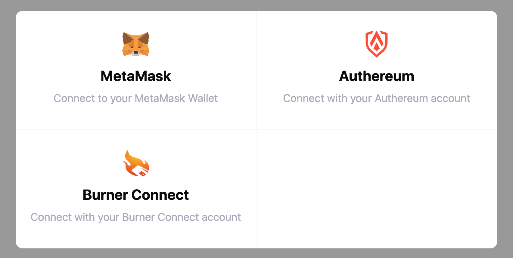

# Gear for Punks ERC721 Smartcontract + Website

Ethereum erc721 derivative of GEAR but for futuristiv punks that uses the following tools:

- Hardhat
- Waffle
- ethers.js
- Vue & Vuex
- Web3Modal
- WindiCSS
- Vue Toasted
- Vue Gravatar

## Features

### Seamless connect/disconnect wallet experience (using Web3Modal)

Web3Modal is used to support various different Ethereum wallets. When user switches between accounts and even chains, the UI quickly notices that and adapts to the change (account and ETH balance data are refreshed).



### Alert when not on mainnet

If user's wallet is not set to Mainnet, an unobtrusive yellow alert band shows up just above the navigation bar. The alert notifies the user which (testnet) chain they are currently using.

### Storing contract addresses and ABIs on front-end

The deploy.js script automatically stores all contract ABIs and their respective addresses in the /frontend/src/contracts folder.

Addresses are separated from one another per contract name and also per chain ID.

Example (`addresses.json`):

```json
{
  "Token":{
    "1337":"0x78afecb367f032d93eDf865Ada339AFf6ef2621b",
    "3":"0x5FbDB2315678afecb367f032d93F642f64180aa3",
    "1":"0xE2Df865998BD3f20117e037d1293367f032d93F6"
  },
  "Farm":{
    "1337":"0x1Cf865998BD3f20eB6BCdAda339aa8BD3f2e26eb",
    "3":"0x998BD3f20eB6Bafecb3673f201ca17e037d10aa3",
    "1":"0xBCdAda33b67815678afecb365998BD3f2e26BCdA"
  }
}
```

## npm install

Run installations in both root and in the frontend folder:

```bash
npm install
cd frontend && npm install
```

## Run Vue app

```bash
cd frontend && npm run serve
```

## Tests

### Solidity/Hardhat

```bash
npx hardhat test
```

## Deployment to ganache

```bash
npx hardhat run scripts/deploy.js --network ganache
```

## Deployment to a remote blockchain

```bash
npx hardhat run scripts/deploy.js --network goerli
```

## Verify on Etherscan

```bash
npx hardhat --network mainnet etherscan-verify --api-key <apikey>
```

## Open Sourcing

In an effort to keep Gear a community owned ecosystem, the website and contract code will be open source.

We encourage you to make PRs you see fit to this project to expand on what you see fit.
A growing list of projects created for Gear will be added to the website

###### Please reachout in the #dev-list channel of the [discord](https://discord.gg/rc8bGuyh3Z) to be added as github team memeber 

### Rules
---
 
 #### •  PR Creation
Fork the project and make a public repo if possible
Create a pull request to the main branch
Merger team will vote to approve submitted changes if PR passes merge checks

#### • Build shit and have fun

## Credits
- This was started with a temple from  @remote-gildor [hardhat-vue-starter](https://github.com/remote-gildor/hardhat-vue-starter)
- @dhof Loot's solidity smartcontract on Etherscan.io
- Gear Mafia (Discord usernames): @cyberghost, @null_hax, @iuvenis, @Doodles